# Soft actor critic (SAC)
## Descrizione dell' algoritmo
Soft actor critic è un algoritmo di deep reinforcement learning off-policy derivato da *DQN (Deep Q Learning)* e con esso condivide le seguenti funzionalità:
* La Q function viene approssimata da una rete neurale *(input: (stato, azione), output: valore)*
* Non si utilizza un modello di transizione, ma si acquisisce conoscenza dall' esplorazione
* L' agente conosce lo stato in cui si trova (o comunque una descrizione parziale dello stato attuale)
* L' agente conosce le azioni che è in grado di compiere

SAC però inserisce il concetto di entropia all' interno del funzionamento dell' algoritmo.
L' entropia definisce la *casualità* della policy: più è elevata, più l' output della policy diventa imprevedibile, Viceversa un entropia pari a 0 significherebbe che la policy è deterministica (prevedibilità massima).
L' entropia della policy nello stato s è formalmente definita da 
* **H(π(.|s)) = ∑P(π(a|s))\*(-log(P(π(a|s)))** per ogni a (azione) possibile da parte dell' agente
  
ovviamente per questo motivo l' algoritmo è progettato per lavorare con policy stocastiche (per lo meno durante la fase di training), altrimenti questo termine sarebbe sempre pari a 0.

SAC presenta le seguenti peculiarità:
* Funziona solamente con uno spazio di azioni continuo
* La policy è implementata tramite una rete neurale *actor* con un determinato set di pesi *(input: stato, output: azione)*
    * Per questi 2 motivi la policy non viene aggiornata selezionando l' azione che massimizza la Q function per un determinato stato (non sarebbe possibile), ma aggiornando i pesi della policy seguendo il gradiente calcolato su V(s) rispetto ai pesi della policy
	  (si modificano i pesi in modo da massimizzare V(S))
    *  V(s) viene approssimato usando la Q function, la quale in input ha lo stato attuale e l' azione viene scelta usando il *reparametrization trick* che verrà discusso in seguito
* Utilizza 2 Q function *Q1 e Q2*, ciascuna delle quali ha la corrispondente target network (come per l' algoritmo *TW3*)
	* Ogni aggiornamento coinvolge entrambe le Q, ma per l' aggiornamento della policy e per il calcolo dei target si usa sempre il valore minore tra le due per la stessa coppia stato-azione (per evitare picchi anomali possibili nella funzione Q)
* Oltre al reward, SAC include l' entropia per il calcolo della *value function* (e di conseguenza la *Q function*)
* Il Reward cumulato per V viene riscritto come **R(s,a,s') + α\*H(π(a|s))** dove α sarebbe il coefficiente di tradeoff: un valore che permette di dare più o meno priorità all' entropia rispetto al reward.
* Nell' implementazione però vengono considerate 2 approssimazioni:
	* Q(s,a) non considera l' entropia per il reward istantaneo (quindi viene considerato solo r)
	* Q(s,a) approssima l' entropia **H(π(.|s))** calcolandola come **-α\*log(π(a'|s))**
	* Di conseguenza **Q(s,a) = r + γ\*Q(s',a')-α\*log(π(a'|s'))) dove a' è un' azione etratta dalla policy stocastica π nello stato s'**
* La value function viene approssimata con **V(s)=tanh(μ(s)+normal(mean=0, std=1))** dove μ(s) è la policy deterministica calcolata dalla rete neurale (questa approssimazione è chiamata *reparametrization trick*)

L' aggiornamento delle Q, Q target e policy avviene dopo ogni azione (step) da parte dell' agente (dopo le prime 100) tramite batch normalization e polyak update (quest' ultimo però riguarda solo Q target e in pratica sarebbe un aggiornamento pesato della Q target usando la Q dove un peso 𝜏 compreso tra 0 e 1, viene usato con la formula *Qtarget = 𝜏 \* Q + (1-𝜏) Qtarget*)
## Descrizione dell' environment
L' environment su cui si è sperimentato l' algoritmo è il LunarLanderContinuous-v2 caratterizzato da:
* agente: lunar lander simulato
* action space: 2 attributi float (lista):
	0. main engine: indica la potenza del motore che o è spento o applica un' accelerazione al lunar lander verso l' alto (valori compresi fra 0.5 e 1 quando è acceso indicano la potenza, sotto 0.5 il motore è spento)
	1. side engines: quando è compreso fra -1 e -0.5 applica un accelerazione da parte dell' engine sinistro (verso destra) e quando è compreso tra 0.5 e 1 l' accelerazione è applicata dall' engine destro (verso sinistra), mentre i valori compresi tra -0.5 e 0.5 indicano che l' engine è spento
* stato: 6 attirbuti float (lista)
	0. coordinate orizzontali (0 nello stato iniziale)
	1. coordinate verticali (0 nello stato iniziale)
	2. velocità orizzionale
	3. velocità verticale
	4. angolo di rotazione
	5. velocità angolare
	6. 1.0 se la prima gamba del lunar lander è appoggiata a terra, 0.0 altrimenti
	7. 1.0 se la seconda gamba del lunar lander è appoggiata a terra, 0.0 altrimenti
* rewards: 
	* -0.3 per ogni frame nel quale l' engine usa il main engine
	* -0.03 per ogni frame nel quale l' engine usa uno dei side engines
	* -100 lander incidentato (fine episodio)
	* +10 per ogni gamba che appoggia sul terreno
	* +100 per l' atterraggio (fine episodio)

## Obiettivo (trattazione informale)
SAC grazie all' entropia permette di incentivare le azioni poco probabili per la policy stocastica attuale, che ovviamente all' inizio restituisce azioni che non rispecchiano una conoscenza completa dell' ambiente.
Questo permette una maggiore esplorazione, così il training può coinvolgere più coppie stato-azione e la policy imparata dovrebbe riflettere il comportamento migliore nelle situazioni non esplorate, perchè più generalizzata (*policy smoothing*).
Lo scopo del trade-off coefficient è quello di dare la possibilità di diminuire il peso dell' entropia sul valore degli stati e dare più priorità all' exploitation o dare lo stesso peso (alpha = 1) a reward e entropia, in modo da dare più valore alle azioni che si distanziano maggiormente da quelle intraprese dalla policy deterministica.

## Tweaking dei parametri:
Per il training ci sono diversi tipi di parametri modificabili in questa sezione li elencherò con una breve descrizione
* numero dei episodi per training: ho notato che il trend dei reward accumulati non subisce grosse variazioni dopo circa l' episodio 500 per ogni test, quindi ho preferito non andare oltre i 1001 episodi (anche per evitare overfitting)
* std_scale (scaling progressivo della deviazione standard della policy): booleano che indica se il valore della rumore associato alla policy stocastica diminuirà (True) o rimarrà costante (False) durante il training.
* std_scaling_type: tipo di scaling usato per il rumore durante il training (verrà discusso in modo approfondito nella trattazione dei test)
* std_decay: valore decimale < 1 che indica un fattore da moltiplicare per il rumore dopo ogni episodio (se il tipo di scaling è standard).
* std_min: valore minimo di rumore.
* std: valore iniziale della std.
* Il coefficiente di trade-off alpha presenta gli stessi parametri del rumore std (valore iniziale, scaling si/no, valore minimo, tipo di scaling, fattore di scaling)
* buffer size: massimo numero di elementi presenti nel replay buffer
* batch: numero di tuple (s, a, r, s', done) usate per il calcolo delle loss functions (experience replay)
* actor: parametri della rete neurale che rappresenta la policy:
	* numero di hidden layers (lasciato sempre a 2)
	* nodi per ogni hideen layer
* critic: parametri per la rete neurale che rappresenta le funzioni Q
	* numero di hidden layers collegati solo allo stato di input (o azione di input)
	* numero di nodi per per hidden layer collegati solo allo stato di input (o azione di input)
	* numero di hidden layers generici
	* numero di nodi per ogni hidden layer generico

## Discussione dei test
Ogni test consiste in una configurazione di parametri provata su 3 seed per la generazione dei valori pseudocasuali (3, 9, 25) che sono stati abbastanza per verificare l' andamento di SAC all' aumentare del numero di episodi di training.
Inoltre per ogni test vengono forniti 2 grafici:
* uno che rappresenta il reward fissato il seed (ogni punto indica il reward medio di 20 episodi per il dato seed)
* uno che rappresenta il reward medio dei seed dove sono sovrapposti i dati "mediati" (ogni punto è la media di 20 episodi) con i reward di ogni episodio per dare un' idea del rapporto tra media e varianza dei risultati.

In tutti i test gamma l' ho lasciata a 0.99, perchè in un ambiente come LunarLanding l' obiettivo è fare atterrare il LunarLander in piedi sulla piattaforma dopo una serie di azioni compiute in un insieme continuo di stati, quindi il reward istantaneo ha un' importanza relativamente molto bassa rispetto a quello a lungo termine.
### test1	
* Nel primo test ho usato un tau molto basso (0.0005) poichè in SAC l' aggiornamento dei pesi non è ritardato, ma avviene dopo ogni azione compiuta dall' agente (e con un tau basso non si ha un cambiamento troppo significativo dei pesi della Q target)
* Un tau così basso dovrebbe garantire la convergenza alla policy ottima, anche se questa dovrebbe essere raggiunta dopo un numero elevato di episodi di training.
* L' alpha è fissa a 0.2
	* un valore non troppo alto, in modo da garantire che il contributo dell' entropia al valore della Q non vada a superare il valore del reward (ciò porterebbe alla sola esplorazione)
	* Il valore non è però troppo basso, evitando così di bloccare l' aggiornamento dei pesi su un minimo locale.
* La std del rumore della policy decade di un fattore .99 dopo ogni episodio, in modo da iniziare l' exploitation dei valori corretti da circa l' episodio 400 (.99^400 = 0.018) così da garantire abbastanza esporazione.
* Il valore minimo della std del rumore è comunque 0.01, in modo da garantire sempre una minima esplorazione (anche negli ultimi episodi).
* Dal buffer di 10^6 elementi (scelto ampio per dare un ampia scelta di tuple) ho scelto l' estrazione di un batch di 128 tuple (valore non troppo alto ne basso)
* Ogni rete neurale è costituita da 2 layer (generici) da 64 nodi ciascuna (valore standard)
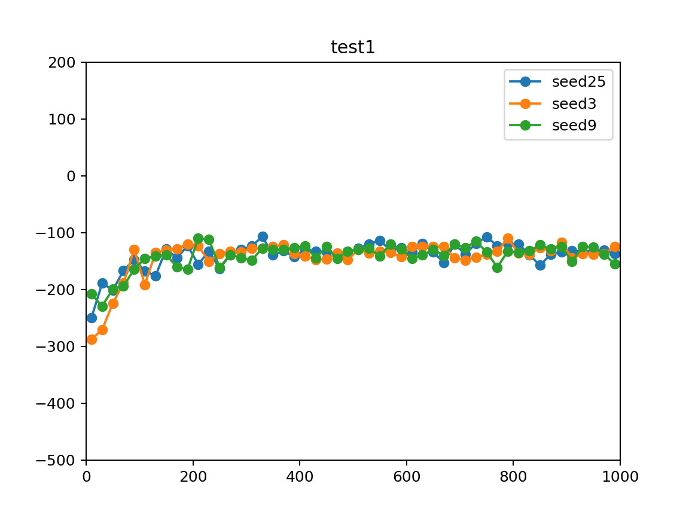
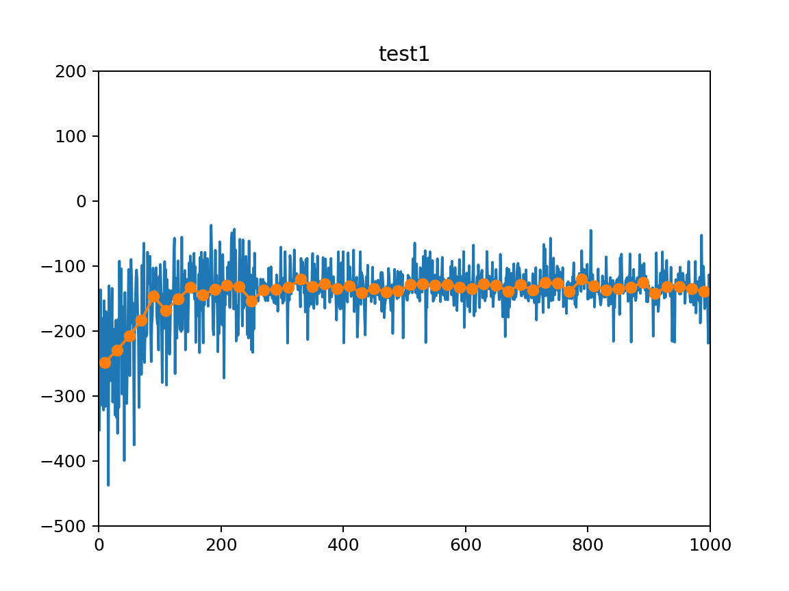
  
* Dai risultati ottenuti sembra che la policy raggiunta attorno all' episodio 300 sia quella che si mantiene fino alla fine del training, una policy che comunque non è ottima (reward medio inferiore a -100) e presenta una moderata varianza nei reward
### test2
* Questo test presenta gli stessi parametri del test1 a differenza di quelli che riguardano il buffer
	* Ho ridotto a 10^5 la dimensione del buffer per dare una maggiore priorità alle esperienze recenti (pur senza usare un valore troppo piccolo che potrebbe influenzare negativamente la casualità del sampling durante l' experience replay)
	* Ho aumentato a 512 la dimensione del batch in modo che il calcolo della loss tenga conto di più esperienze (teoricamente un batch più grande dovrebbe dare maggiore stabilità nella fase di training)
	
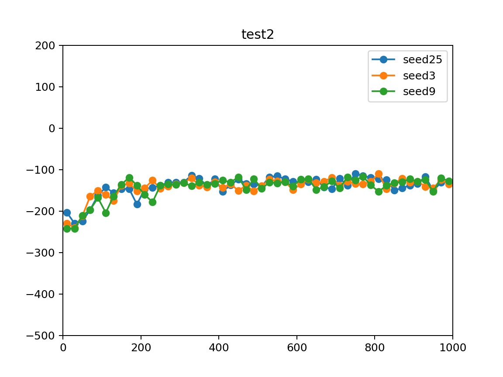

* I risultati ottenuti sono molto simili a quelli di test1, quindi sicuramente il batch e la dimensione del buffer non sono fattori che influenzano in modo notevole l' apprendimento della policy.
### test3
* Questo test presenta gli stessi parametri di test2, ma con un tau inferiore (0.0001), solo che ho notato che i risultati a parità di seed sono coincidenti con il test 2, quindi ho provato ad assegnare a tau valori elevati (come 1.0) e anche in questo caso i risultati ottenuti erano gli stessi.
* Da qui deduco che il parametro tau sia ininfluente sulle performance dell' algoritmo
* Da questo momento in poi non verrà considerato il parametro tau.
### test4
* I parametri di questo test sono gli stessi di test2, fatta eccezione per alpha
* alpha è aumentata a 0.6 (fisso) in modo da dare un peso maggiore all' entropia
* Teoricamente questo dovrebbe portare ad una maggiore esplorazione, dato che ora le azioni che hanno probabilità minore (per un dato stato) acquisicono più valore rispetto al caso alpha = .2.

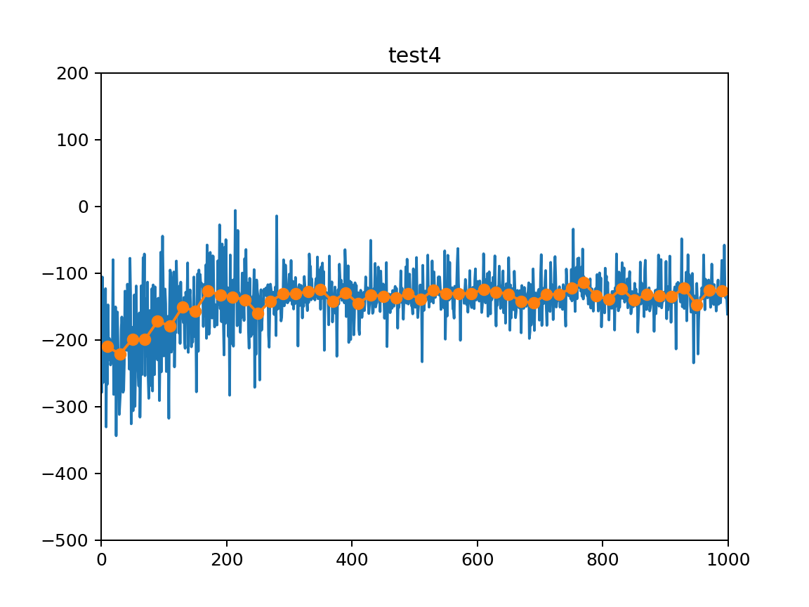
* I dati sembrano essere leggermente più fluttuanti rispetto al test 2, probabilmente perchè la std della policy decade troppo velocemente per l' importanza che ha l' entropia in questo test.
### test5
* Rispetto al test 4 ho aumentato l' std decay da 0.99 a 0.995, in modo da mantenere elevata la std della policy stocastica per più tempo e di conseguenza permettere all' agente di esplorare per un numero maggiore di episodi e sfruttare di più il bonus dato al valore di V e Q da parte dell' entropia

* L' andamento rispetto ai test precedenti è inizialmente più oscillante (probabilmente a causa del decadimento lento della std)
* Però, grazie alla maggiore esplorazione, si ha una convergenza molto più smooth alla policy definitiva.
* questo dovrebbe indicare che la policy che sa generalizzare meglio rispetto alle precedenti perchè la convergenza è avvenuta in modo più lento.
### test6
* Rispetto a test5 ho voluto provare ad aumentare ulteriormente l' alpha fissa (ora a 0.8) per avere un quadro più completo silla correlazione entropia-risultati
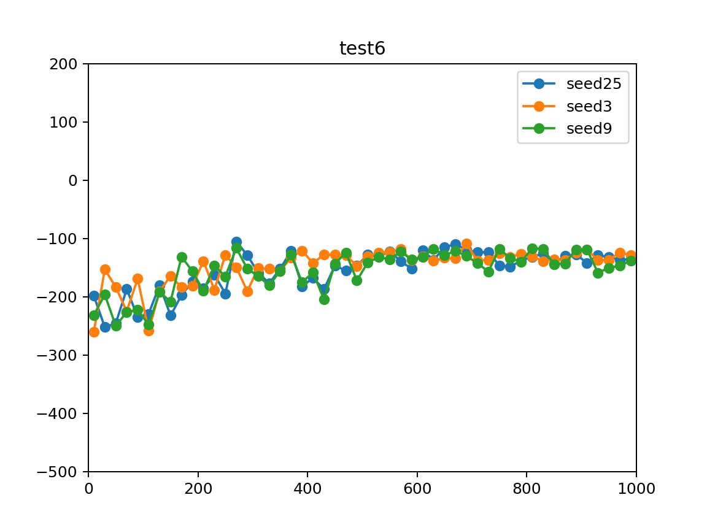

* Dai risultati ottenuti noto che un aumento ulteriore dell' entropia non contribuisce alla convergenza ad una policy migliore dei casi precedenti.
* I risultati sono analoghi  quelli del test5
### test7
* In questo test sono tornato a valori di alpha come nel test5 (0.6)
* A differenza però di test 5, qui l' std decay è più alto (0.997)
* L' obiettivo di questo test è vedere se mantenere il rumore della policy alto per più tempo possa portare a risultati migliori
poichè l' agente dovrebbe esplorare per più episodi rispetto ai precedenti test.

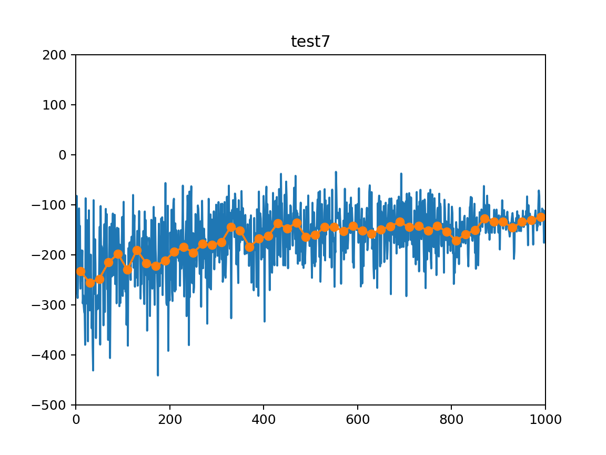
* I risultati si sono rivelati addirittura peggiori rispetto agli altri test
* Anche se l' agente sicuramente ha esplorato di più (i reward ottenuti hanno un' oscillazione molto elevata fino all' episodio 800)
alla fine la policy a cui converge l' algoritmo non è comunque ottimale.
### test8
* Questo test utilizza gli stessi parametri usati in test5 (alpha=.6, std=1, std_decay=.995)
* In questo test ho voluto modificare i parametri della rete Q in modo da dare più indipendenza tra i due input (stato, azione):

* Al livello 1 degli hidden layers si trovano 2 layer:
    * Uno da 32 neuroni collegato allo stato in input
    * Uno da 32 neuroni collegato all' azione in input
* Al livello 2 degli hidden layer si trova un unico hidden layer da 64 neuroni collegato ai due precedenti
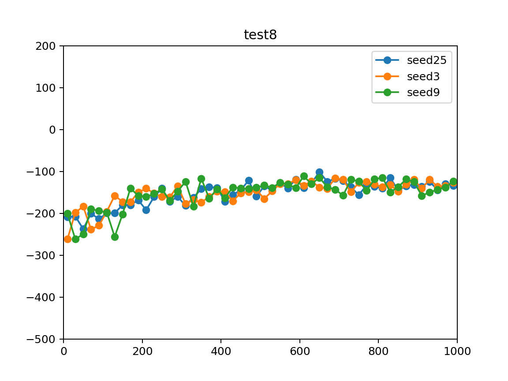

* Sorprendentemente i test sono in linea con il test5, sebbene la struttura della rete sia completamente diversa
### test9
* Sempre prendendo come riferimento il test5, ho modificato la rete in modo da avere 256 neuroni per le 2 hidden layers generiche

* Aumentare il numero di neuroni per gli hdden layers non sembra influenzare particolarmente l' andamento di SAC
### test10
* Anche questo test si basa sul test5 (inclusa la struttura della rete)
* Dato che nei test precedenti i valori alpha 0.2 e 0.6 hanno dato risultati simili, ho voluto provare in questo test a usare
il valore 0.4 (media dei 2) che dovrebbe dare risultati non troppo distanti dagli altri test a parità di parametri.
* In aggiunta a questo ho voluto provare a scalare la std della policy stocastica usando una funzione che si ottiene dallo stretching/scaling/shifting
della tangente iperbolica (std_scaling_type: 'tanh_time') dove la variabile indipendente sarebbe il numero dell' episodio e l' output sarebbe il valore della std
* Questo dovrebbe garantire un std molto alta (circa 1) nei primi 200 episodi che poi cala drasticamente tra l' episodio 250 e 400 per poi convergere a 0

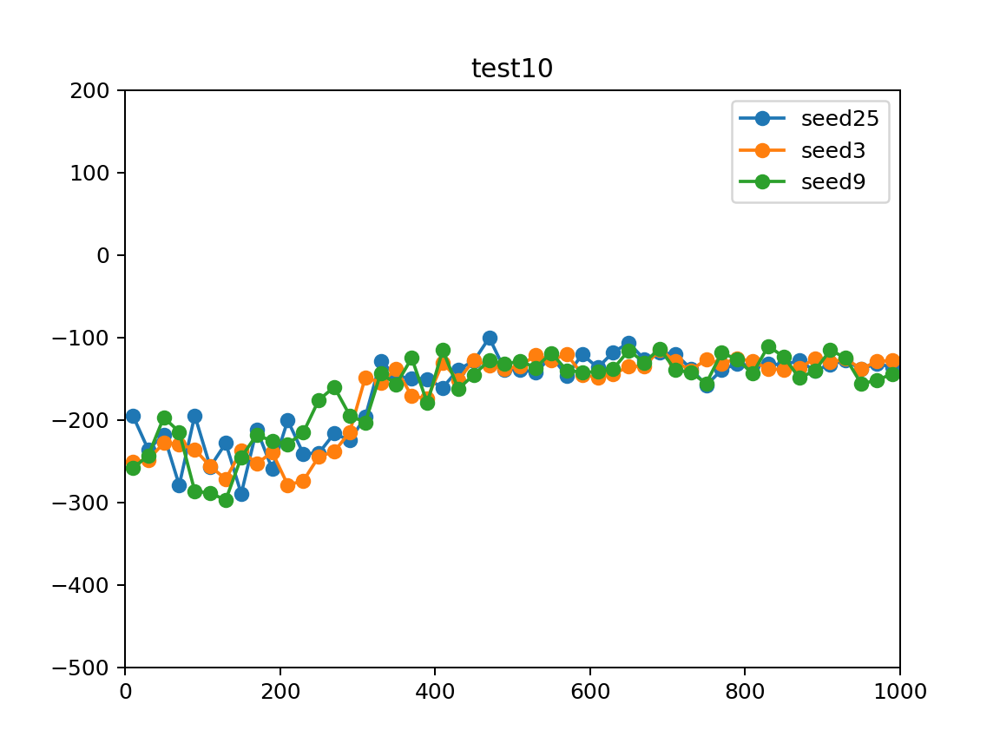
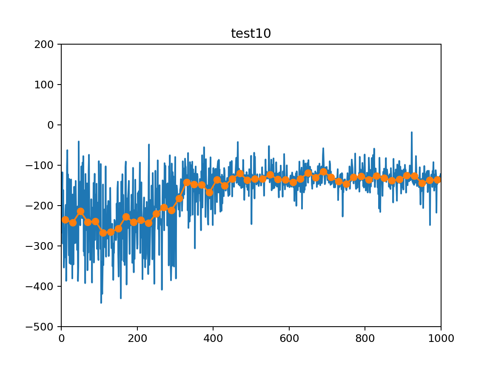
* L' andamento è molto simile a quello dei test precedenti, ma l' std bassa verso la fine garantisce valori meno oscillanti.
### test11
* Ho voluto modificare l' alpha in modo da variare in base al reward medio secondo una funzione che è una trasformazione di una sigmoide (alpha_scaling_type: 'sigmoid_reward')

* la variabile indipendente sull' asse x sarebbe il reward medio su 100 episodi
* il denominatore per x è molto alto, perchè altrimenti ci sarebbero voluti dei reward medi molto alti (vicini allo zero) prima di avere un alpha << 1.
* il motivo per cui ho voluto provare questo approccio è dovuto al fatto che teoricamente quando il reward medio è molto basso bisognerebbe dare priorità all' eplorazione
e invece se fosse molto alto bisognerebbe dare più priorità ai valori corretti delle coppie stato-azione.
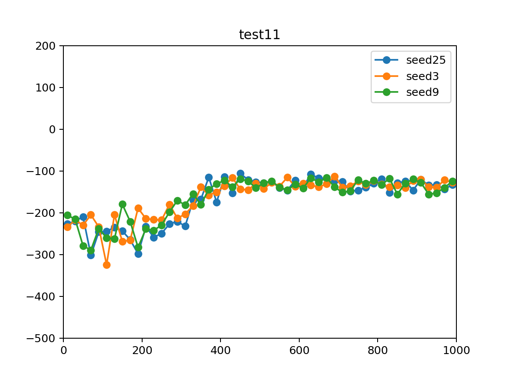
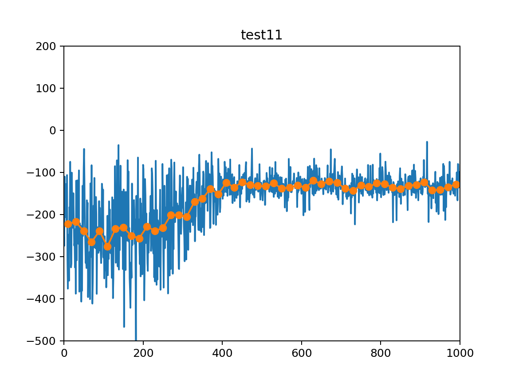
* anche in questo caso i risultati non sono stati pessimi, ma in linea con i precedenti.
### test12
* In questo test ho modificato test11 in modo da usare la funzione basata su tanh (e avente il numero dell' episodio sull' asse x)
sia per l' alpha che per la std
* questo dovrebbe massimizzare il contributo dell' entropia e della casualià della policy nei primi 200 episodi per poi renderlo
quasi zero dall' episodio 450
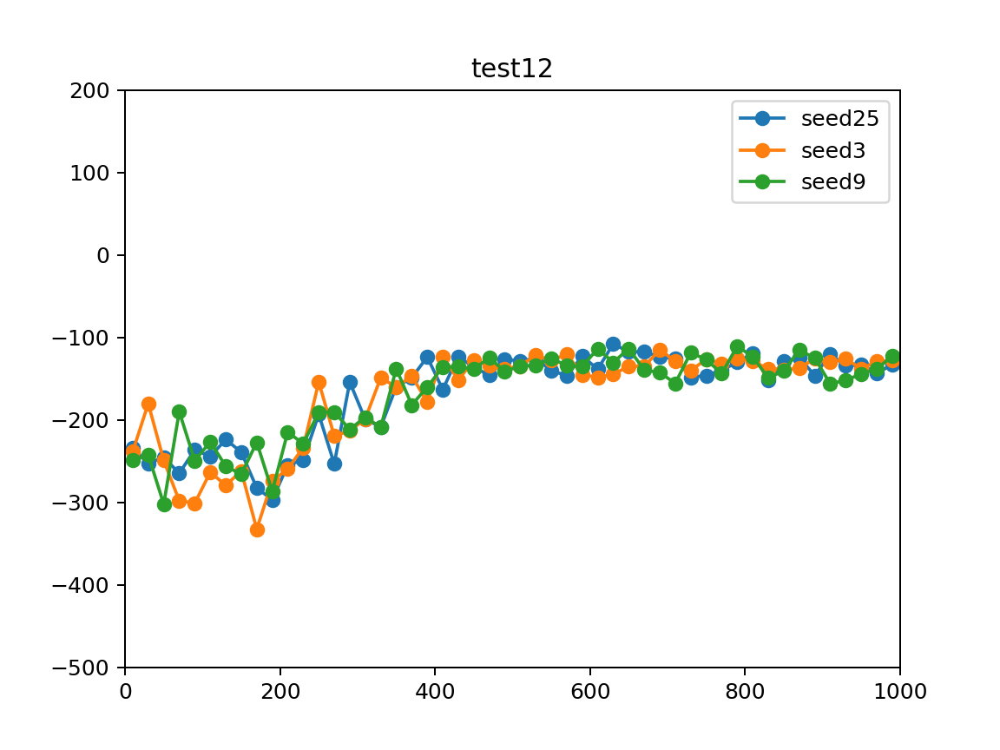

* I risultati sono in linea con i test precedenti
### test13
* Dato che variare alpha non si è rivelato particolarmente utile ho deciso di vedere se il raggiungimento di una policy sub-ottima sia dovuto
a un caso di overfitting, così ho deciso di diminuire i nodi dei layers interni di entrambe le reti da 64 a 16
  

* I risultati sono in linea con quelli dei test precedenti, però l' utilizzo di un minor numero di layer potrebbe indicare
che non sono necessari 64 layers per modellare la policy NN e le Q NN, ma 16 dovrebbero bastare.
* questo sicuramente dovrebbe generalizzare meglio le funzioni e sicuramente il training è computazionalmente più veloce
### test14
* Per finire ho deciso di modificare il test13 aggiungendo un fattore costante per il decay di alpha (precedentemente
  il decay di alpha era sempre parametrizzato da funzioni o era statico)
* Alpha iniziale è 0.6, quello minimo è 0.01 e dopo ogni episodio viene moltiplicato per .995 (come std)
* Gli hidden neurons come in test13 sono 16 per tutti gli hidden layers di tutte le reti
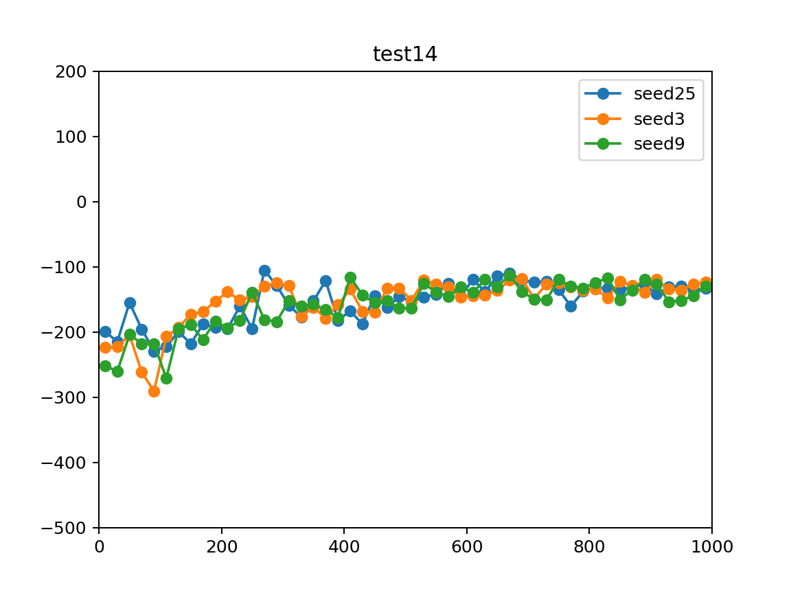

* Anche in questo test l' andamento della policy è in linea con quello degli altri test. 

## Conclusione
* Anche modificando i parametri utilizzati da SAC, l' algoritmo converge sempre ad una policy sub-ottima, con un reward medio sotto i -100.
* Da qui ipotizzo che le performance mediocri dell' algoritmo siano dovute al fatto che l' agente si muove in un ambiente dove le lo spazio delle azioni è continuo e che quindi questo spazio
viene rappresentato all' interno del calcolatore con una discretizzazione troppo fitta che non permette di rappresentare il problema con un' astrazione abbastanza elevata
da eliminare i dettagli superflui (e fuorvianti) per quanto riguarda le azioni dell' agente.
* Algoritmi come DQN (più semplici) funzionano bene su ambienti con spazio degli stati continuo perchè comunque per un dato stato possono 
selezionare l' azione che massimizza la Q attuale per quel dato stato grazie allo spazio discreto delle azioni e questo purtroppo non è possibile farlo se lo spazio è continuo.
* L' aspetto positivo è che comunque il reward medio dell' algoritmo si mantiene sempre su livelli abbastanza stabili, mantenendosi
in media attorno a -120 come reward cumulato per ogni episodio.
* Si può vedere dai grafici che quando la std della policy è vicina allo zero, l' algoritmo ha una varianza nei reward per episodio abbastanza bassa.
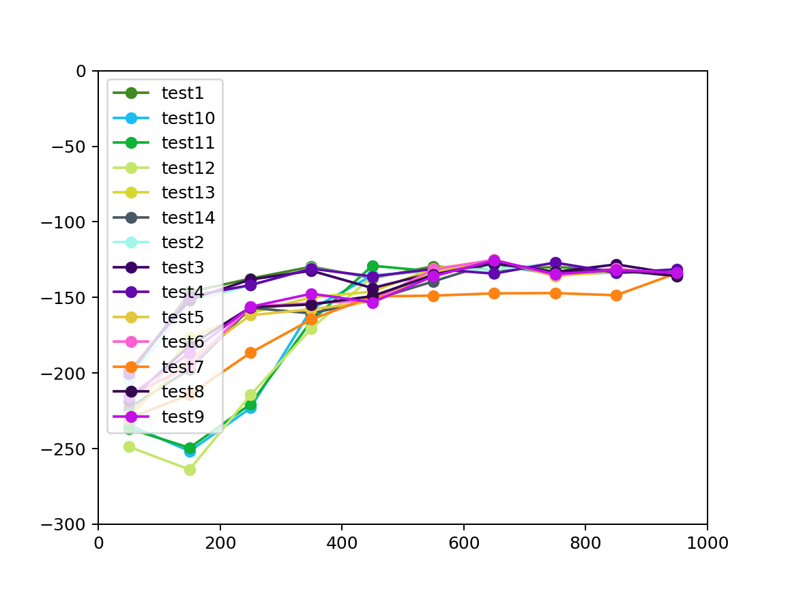
## Info sui grafici
* I grafici delle funzioni usate per ottenere alpha e std dinamicamente sono stati realizzati con MATLAB (ezplot)
* I grafici informativi sono stati ottenuti con lo script generate_graphs.py
## Fonti
* [SAC description](https://spinningup.openai.com/en/latest/algorithms/sac.html)
* [Graphs directory](https://github.com/nickpoz97/SAC/tree/master/graphs)
* [Results directory](https://github.com/nickpoz97/SAC/tree/master/stored_results)